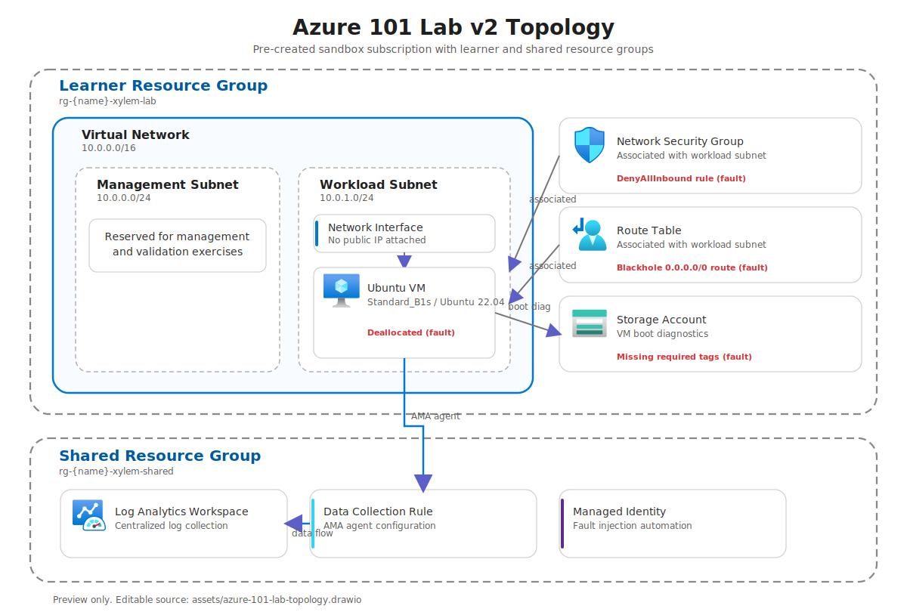

# Azure 101 Lab

This repository holds the Azure 101 / Azure Operations lab assets.

## Scope

The initial lab is a 90-120 minute hands-on Azure Operations lab for cloud engineers.

Primary focus areas:
- VM troubleshooting
- VNet / NSG / routing validation
- Azure Monitor and KQL triage
- RBAC troubleshooting
- Cost and policy validation

## Delivery model

- v1 is a manual lab delivered from markdown in this repository
- assume a sandbox subscription already exists for the customer
- each lab user receives their own resource group in that sandbox
- each lab user builds their own resources during the lab, including VNets, NSGs, VMs, and storage accounts
- Bicep is deferred to a future v2 version of the lab

## Architecture diagram

Editable Draw.io source: [assets/azure-101-lab-topology.drawio](assets/azure-101-lab-topology.drawio)

The diagram captures the v1 learner environment:
- one learner resource group inside a pre-created sandbox subscription
- one virtual network with separate management and workload subnets
- a private Ubuntu 22.04 VM in the workload subnet
- NSG, route table, NAT Gateway, and Standard public IP supporting the workload subnet
- storage account and Azure Monitor dependencies used during troubleshooting exercises

## Project structure

- [docs/v1-framework.md](docs/v1-framework.md) - initial lab framework
- [docs/student-guide.md](docs/student-guide.md) - participant-facing guide
- [docs/self-guided-playbook.md](docs/self-guided-playbook.md) - self-guided lab structure and checkpoints
- [docs/scenario-list.md](docs/scenario-list.md) - scenario inventory for v1
- [docs/build-checklist.md](docs/build-checklist.md) - participant build checklist
- [docs/lab-agenda.md](docs/lab-agenda.md) - recommended 90 and 120 minute agendas
- [docs/answer-key.md](docs/answer-key.md) - redirect noting that solution content now lives in the student guide
- [docs/troubleshooting-guide.md](docs/troubleshooting-guide.md) - common troubleshooting method and Azure tools
- [docs/resource-map.md](docs/resource-map.md) - minimal v1 topology and resource relationships
- [docs/v2-roadmap.md](docs/v2-roadmap.md) - deferred automation backlog
- assets/ - diagrams and supporting visuals

## Next steps

1. Refine the exact step-by-step build flow for the student guide
2. Turn the scenario list into concrete self-guided exercises
3. Add exported screenshots or rendered images under assets/ for README-friendly previews
4. Capture pilot feedback and adjust the v2 backlog
